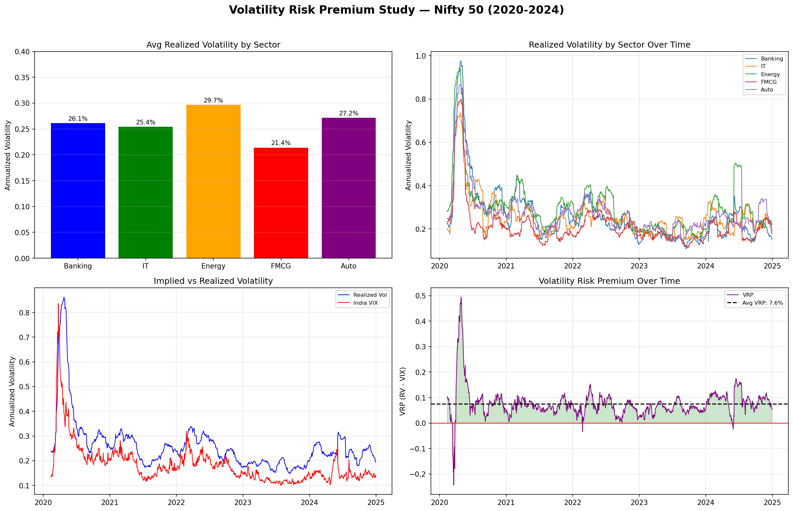

# Volatility Risk Premium Analysis — Nifty 50

## Overview
This project analyses the gap between implied and realised volatility across 15 Nifty 50 stocks spanning 5 sectors over a 4-year period (2020–2024), quantifying the Volatility Risk Premium (VRP) in Indian equity markets.

## Objective
To determine whether options markets systematically overprice risk by comparing India VIX (implied volatility) against 30-day rolling realised volatility computed from daily returns.

## Sectors Covered
- Banking
- Information Technology
- Energy
- FMCG
- Automobile

## Key Findings
- Average VRP of **7.6%** across all 15 stocks
- VRP was positive on **98.5% of trading days**, confirming consistent overpricing of risk in options markets
- **Energy** sector recorded the highest average VRP (**11.3%**)
- **FMCG** sector recorded the lowest average VRP (**3.0%**)

## Dashboard

## Tools & Technologies
- Python (Pandas, Matplotlib)
- Jupyter Notebook

## Author
Inaya Arora — B.E. Electronics and Communication Engineering, BITS Pilani Hyderabad Campus
